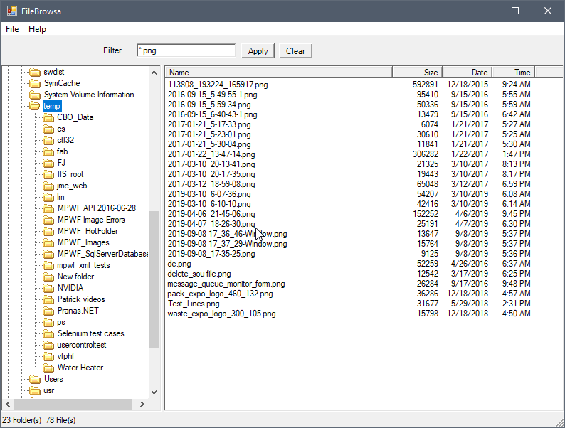

# FileBrowsa

A simple Windows GUI app to browse files in a folder, much like Windows Explorer. 

**One big thing about this utility is that it supports command line parameters when launching the app so you can pass the initial starting folder, and a filter or file mask expression to apply to the file list.  In the app, you can double-click on any filename to launch the default Windows app to open or edit the file.**
 
 (Full disclosure, the starting point for this app was a project I found on Code Project written by Russell Mangel. Link in credits below.) 

Once you copy the exe to a folder on your computer, you can just double-click to launch the app, but it also supports command line parameters allowing you to specify the starting folder and an optional filter expression if you want to apply a file mask to limit which files are displayed.

Command line example:
```dos
FileBrowsa "C:\MyPath" "*.pdf"
```


## Change Log

* Updated 2021-03-16 by Matt Slay
* Added Command Line Parameters to accept a Path and file mask (filter)
* Added a textbox on the GUI form for the Filter string.


## ToDo (planned updates:)
* Add a textbox for the Path so user can enter/edit from keyboard.
* Add feature to rename or delete a file.
* Add feature to launch Windows Explorer for the current folder.


## Credits

> Original Author: Russell Mangel (2002-05-01) 
>
> Original Program:		TV-LV-Basic Version 4.1
>
> Original code downloaded from: https://www.codeproject.com/Articles/2316/Windows-Explorer-in-C
>
> Designed initially to demonstrate TreeView & ListView Control, but this is also a good example of processing folders and files.

## Helpful links of coding used in this app:

* Command Line parameters: 
 https://stackoverflow.com/questions/1179532/how-do-i-pass-command-line-arguments-to-a-winforms-application


* Simple databinding in WinForms:
 https://www.codeproject.com/Articles/11530/Understanding-Simple-Data-Binding
